# JPower: A rapid development platform for microservices

   

### QQ Number : 860452768
> tip: After joining the group, you can get a free code generator with the screenshot of Star
-------

#### JPower is just getting started, many features are still under development, so stay tuned...

## JPower summary
`JPower`It is upgraded and optimized from a government commercial project.

Adopting the front-end and back-end separation model, front-end open source projects:[jpower-ui](https://gitee.com/gdzWork/jpower-ui) (basedOn AVue、Vue、Element-UI)、[JPowerWeb](https://gitee.com/deep_letters/jpower)(basedOn Vue、Element-UI)

`JPower` basedOn`SpringCloud(2020.0.1)`  + `SpringBoot(2.4.2)` a rapid development platform for microservices
It has multiple modules such as unified gateway authentication, Xss anti-cross-site attack, and distributed transaction, and supports the parallel development of multi-service systems.
Supports parallel development of multiple services and can be used as a scaffolding for the development of back-end services. The code is concise, the comments are complete, and the structure is clear. It is very suitable for learning and use as a basic framework.
`JPower` The blueprint of the goal is to be able to create a development framework that integrates a variety of useful tools, such as configuring various reports on the page, integrating echarts to achieve rapid page generation, data transmission in various scenarios, and so on. tool.
At present, only the basic architecture has been developed, and various tools will be gradually developed into the framework in the future.

Core technology adopts spring cloud alibaba、SpringBoot、Mybatis、Seata、Sentinel、SkyWalking main frameworks and middleware。
I hope to work hard to create a set of solutions that integrates `basic framework` —>`distributed microservice architecture` —> `tool integration` —> `system monitoring`. `This project aims to achieve basic capabilities and does not involve specific businesses. `

Using JWT for Token authentication can expand and integrate Redis and other fine-grained control schemes.

The registration center and configuration center select Nacos to strengthen the linkage between the modules while reducing the weight of the project.

The integration of Sentinel protects the stability of services from multiple dimensions such as flow control and fuse degradation.

The code generator is implemented based on MybatisPlus-generator.

## Branch introduction
1. master The branch is the latest stable version, and each commit will be upgraded with a version number
2. dev The branch is the author's development branch. The latest code developed by the author will be submitted in real time. Those who like early adopters can switch to dev. But there may be errors, omissions, etc. If you are not familiar with the project, please don't try it.
3. tag Each fixed version will be tagged with a tag to facilitate subsequent switching of any version.

## Technical documents
* [JPower Development Manual](https://www.kancloud.cn/guodingzhi/jpower/)

## Project demonstration address
- Project demonstration address： http://jpower.top:81
- Super user login（Tenant code：000000）：
- administrator： root/123456
- Tenant user login（Tenant code：LXD0DP）：
- Ordinary account： admin/123456

> ps: No write permission in the demo environment

## Business function introduction：
1. Tenant management: super user role manages all tenant creation
3. Organization management: department, user data maintenance, reset user password, etc.
4. Permission settings: data permissions, role management, bind users to roles, authorize menus and resources to roles
6. System settings: menu function, attachment management, dictionary, administrative area, system parameters, application management, etc.
7. Gateway management: current limiting and blocking access, registration center
8. System monitoring: interface documentation, service monitoring, SkyWalking monitoring, etc.

## Project highlights feature introduction:
1. **Service registration & discovery and invocation：**

    Service registration and discovery based on Nacos, using OpenFeign to realize service intermodulation, It is possible to achieve the same coding experience as calling a local method when using HTTP requests for remote calls. Developers are completely unaware that this is a remote method, let alone an HTTP request.

3. **Service authentication:**

    JWT is used to strengthen the authorization verification of scheduling between services to ensure the security of internal services.

4. **Fuse mechanism：**

    Because of the distribution of services, in order to avoid the "avalanche" of calls between services, Sentinel is ​​used as a fuse to avoid the "avalanche" between services.

5. **Monitor：**

    Use Spring Boot Admin To monitor the running status of each independent Service; use SkyWalking to view the call chain between each service, etc.

6. **Link call monitoring:**

    At the same time, it realized SkyWalking as the full link performance monitoring of this project, Various indicators are displayed from the overall dimension to the partial dimension, and the performance information of all call chains across applications is displayed in a centralized manner, which can facilitate the measurement of overall and partial performance, and facilitate the identification of the source of the failure, which can greatly shorten the troubleshooting time in production.
    
7. **Data permission**

    The data permission function is realized by using the interceptor based on Mybatis

8. **Anti-cross-site scripting attack(XSS)**
  
    - Pass the filter for all requests Form parameter Filter
    
9. **Online API**

    Because some functions of native swagger-ui are not friendly enough, the domestic open source is adopted`knife4j`, And made a statuser, which is convenient for springboot users to use.

10. **Distributed transaction**

    Integrate Ali's distributed transaction middleware: seata, with **Efficient** And for business **0 intrusion** The way，Solve the distributed transaction problems faced in the microservice scenario。

11. **Automatic query of dictionary data across tables, databases, and services**

    Used to solve the properties of cross-table, cross-database, cross-service paging data or the properties of a single object Echo the pain of dictionary data, Support for static data attributes(Data Dictionary)Automatic injection。

12. **Grayscale release**
  
    In order to solve frequent service updates and launches, version rollbacks, rapid iteration, and collaborative development within the company, this project uses a modified ribbon load balancing strategy to achieve gray release.
   
13. **Interface monitoring**
  
    In order to ensure that the interface is unblocked at any time, the monitoring of the interface is specially developed for this, and the interface monitoring of any other services can also be realized, and some custom parameter settings can be realized.
    
## 工程结构：
~~~
JPower
├── conf -- Configuration file directory
├── jpower-boot -- Boot project implementation
├── jpower-core-login -- Authorized login module
├── jpower-core-server -- Core business module
├    ├── jpower-file -- File module
├    ├    ├── file-api -- File API 
├    ├    ├── file-api-biz -- File API implementation
├    ├    ├── file-biz -- File business realization 
├    ├    ├── file-entity -- File Entity 
├    ├    └── file-server -- File service
├    ├── jpower-user -- User module
├    ├    ├── user-api -- User API 
├    ├    ├── user-api-biz -- User API implementation
├    ├    ├── user-biz -- User business realization 
├    ├    ├── user-entity -- User Entity 
├    ├    └── user-server -- User Server
├    ├── jpower-system -- System module
├    ├    ├── system-api -- System API 
├    ├    ├── system-api-biz -- System API implementation
├    ├    ├── system-biz -- System business realization 
├    ├    ├── system-entity -- System Entity 
├    └──  └── system-server -- System Server
├── jpower-module-common -- Toolkit module
├    ├── common-auth -- Authorization Toolkit 
├    ├── common-dbs -- Database toolkit 
├    ├── common-deploy -- Basic Startup Kit 
├    ├── common-exception -- Anomaly Toolkit
├    ├── common-log -- Log Toolkit 
├    ├── common-nacos -- Nacos Toolkit
├    ├── common-redis -- Cache Toolkit 
├    ├── common-feign -- The feign toolkit also integrates sentinel
├    ├── common-swagger -- Swagger Toolkit
├    ├── common-tool -- Basic Configuration Toolkit 
├    ├── common-transaction -- Distributed Transaction Toolkit 
├    └── common-utils -- Tools 
├── jpower-module-gateway -- Gateway module
├── jpower-op-server -- Operation and maintenance module
├    ├── jpower-api -- Swagger Page
├    ├── jpower-log -- Log Service
└──  └── jpower-admin -- SpringBootAdmin 
~~~
    
## Technology stack：
* The related technologies involved are
    *  Cache：Redis
    *  Database： MySQL 5.7
    *  Persistence framework： Mybatis-plus
    *  API Gateway：Gateway
    *  Service registration and discovery: Nacos
    *  Service consumption：OpenFeign
    *  Load balancing：Ribbon
    *  Configuration Center：Nacos
    *  Service fusing：Sentinel
    *  Project construction：Maven 3.3
    *  Distributed transaction：seata
    *  Traffic Guard of Distributed System：Sentinel
    *  Monitor：spring-boot-admin
    *  Link call tracking&APM Monitoring：skywalking
    *  Nginx
* Deployment aspect
    *  Server：CentOS
    *  Docker 18
    *  Nginx

## Project screenshot：

| Preview | Preview |
|---|---|
| 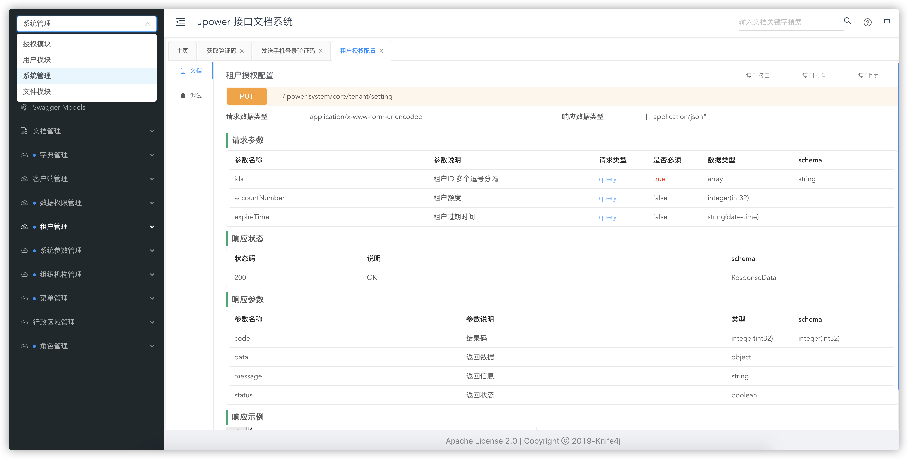 | 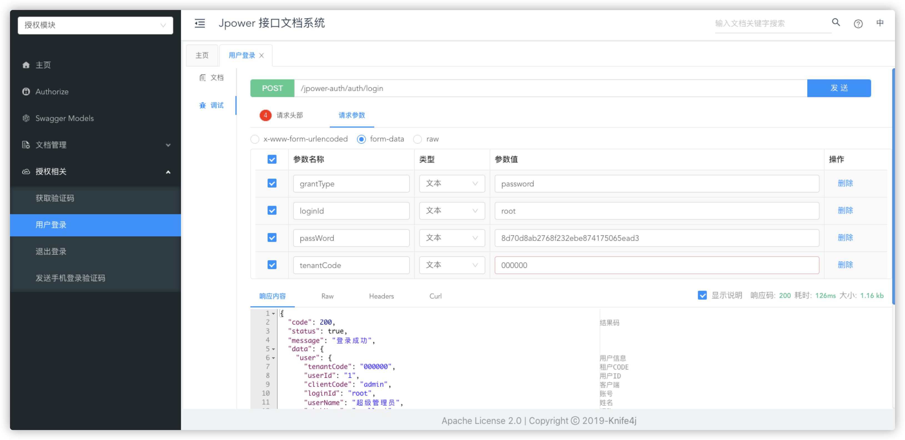 |
| 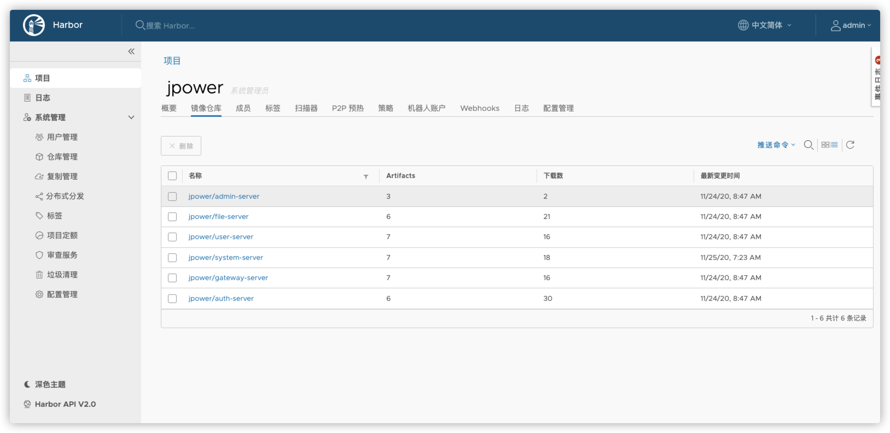 | 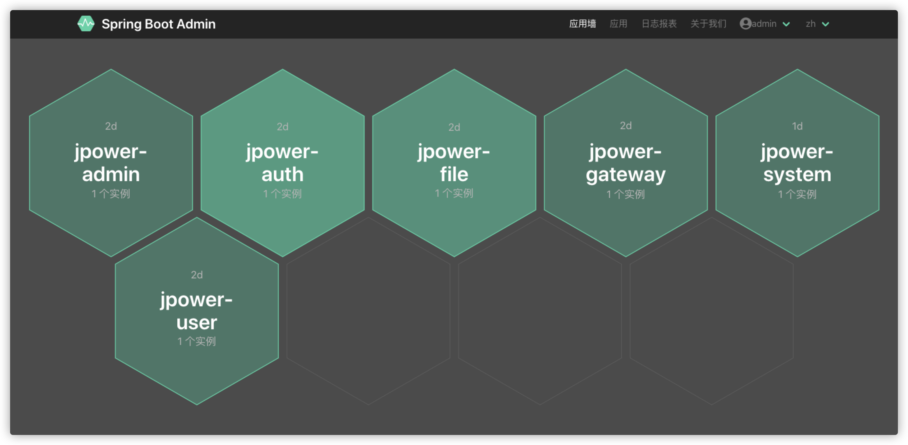 |
| 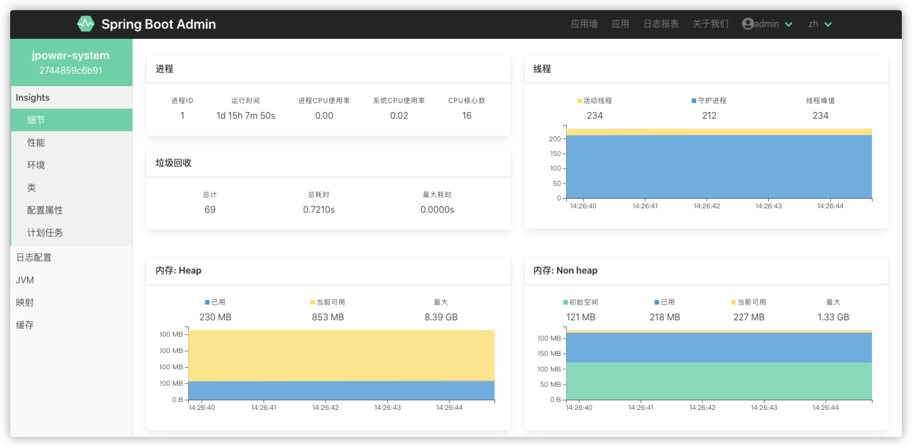 | 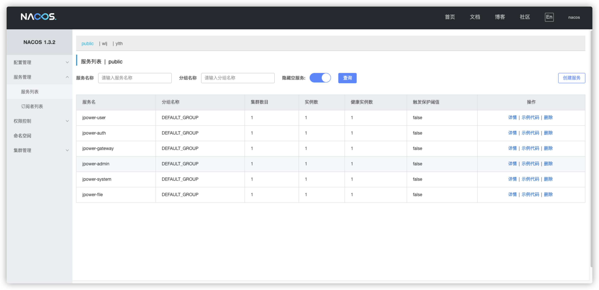 |
| 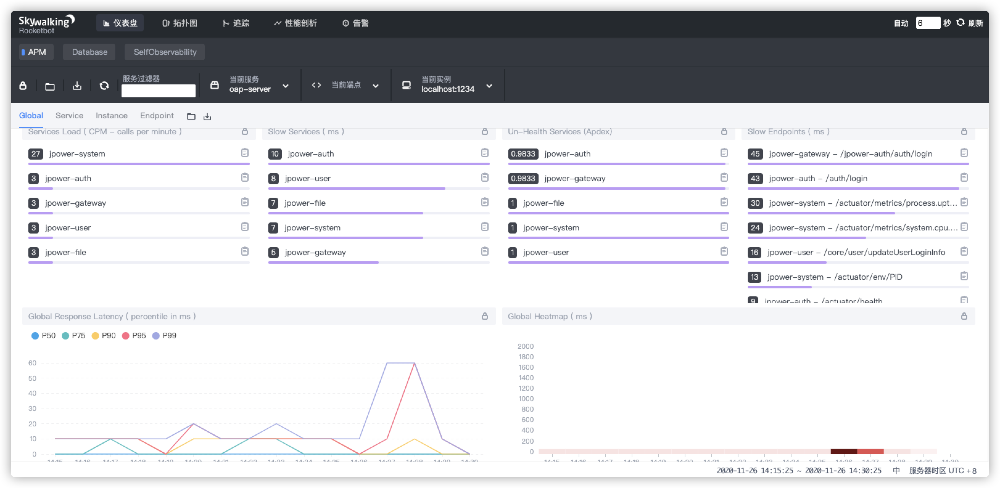 | 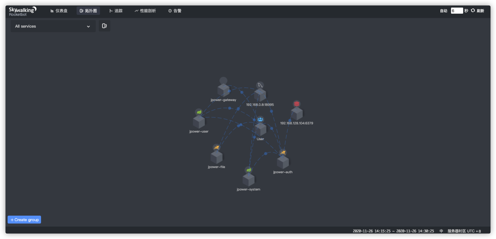 |
| 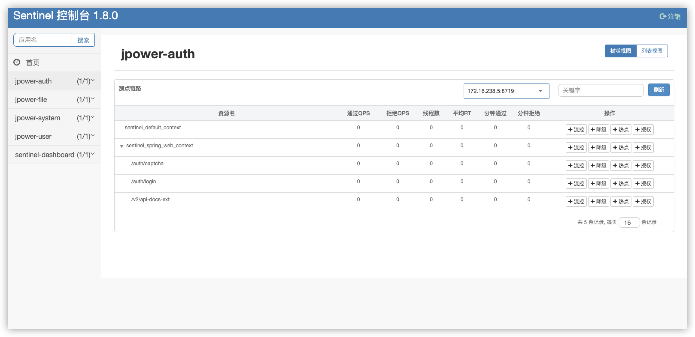 | 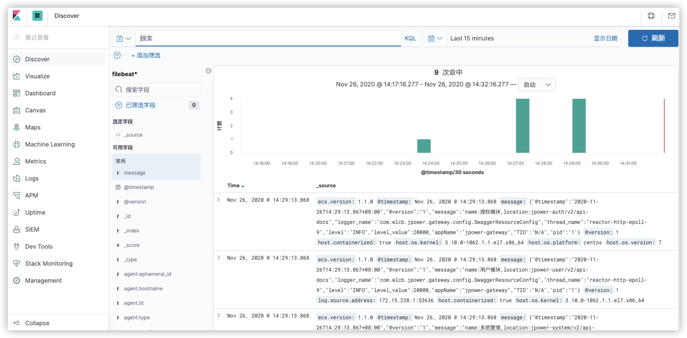 |
| 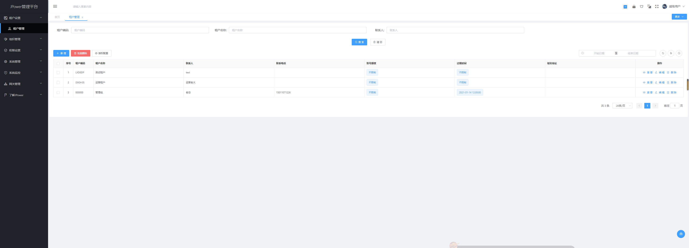 | 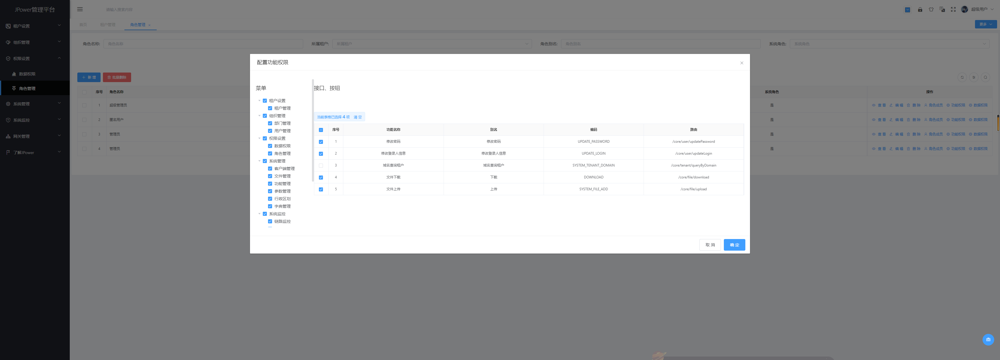  |
| 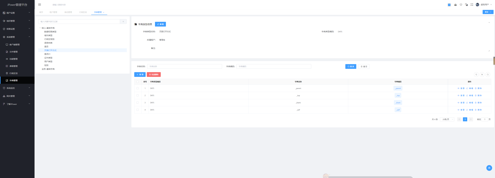 | 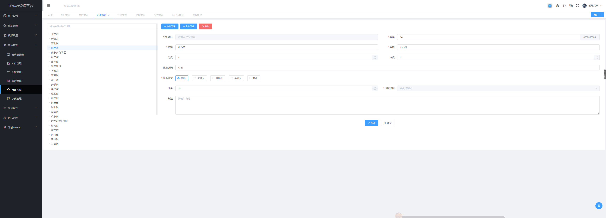 |

# If you feel that this project is of any help to you, please click "Star" in the upper right corner to support it and promote it to your friends and colleagues, thank you!

# Please submit if you find a bug [issues](https://gitee.com/gdzWork/JPower/issues)

# Participate in contribution
1. Fork This warehouse
2. New feat_xxx Branch
3. Submit code
4. New Pull Request

# Thanks to the free open source license provided by JetBrains:

# Friendship link & special thanks
* Microservice rapid development platform：[https://gitee.com/gdzWork/JPower](https://gitee.com/gdzWork/JPower)
* JPowerWeb [https://gitee.com/deep_letters/jpower](https://gitee.com/deep_letters/jpower)
* jpower-ui：[https://gitee.com/gdzWork/jpower-ui](https://gitee.com/gdzWork/jpower-ui)
* Avue：[https://gitee.com/smallweigit/avue](https://www.avuejs.com/)
* JWchat：[https://gitee.com/CodeGI/chat](https://gitee.com/CodeGI/chat)
