# JPower: A Rapid Development Platform for Microservices

   

### QQ Group :  
 > tip: After joining the group, you can get a free code generator with a screenshot of your Star
-------

# Available for various frontend/backend development and mini-programs. Contact WeChat: 953944877

-------

## JPower Introduction
`JPower` is upgraded and optimized from a government commercial project.

Adopting the front-end and back-end separation model, front-end open source project: [jpower-ui](https://gitee.com/gdzWork/jpower-ui) (based on VBen, Vue3, Element-PLUS)

The Boot version has been changed to the [jpower-boot](jpower-boot) module

[//]: # (Boot version：[JPowerBoot]&#40;https://gitee.com/gdzWork/JPowerBoot&#41;)

`JPower` is a rapid development platform for microservices based on `SpringCloud(2025.0.0)` + `SpringBoot(3.5.8)`.
It has multiple modules such as unified gateway authentication, XSS anti-cross-site attack, and distributed transactions, supporting parallel development of multiple business systems
and multiple services. It can be used as a development scaffolding for back-end services. The code is concise, well-commented, and clearly structured, making it very suitable for learning and use as a foundational framework.
The blueprint of `JPower` is to create a development framework that integrates a variety of useful tools, such as configuring various reports on the page, integrating ECharts for rapid page generation, data transmission in various scenarios, and other types of tools.
Currently, only the basic architecture has been developed, and various tools will be gradually developed into the framework in the future.

Core technologies adopt Spring Cloud Alibaba, SpringBoot, Mybatis, Seata, Sentinel, SkyWalking and other major frameworks and middleware.
The goal is to create a set of solutions integrating `basic framework` —> `distributed microservice architecture` —> `tool integration` —> `system monitoring`. `This project aims to achieve basic capabilities and does not involve specific business logic.`

JWT is used for Token authentication, which can be extended to integrate Redis and other fine-grained control schemes.

Nacos is selected as the registration center and configuration center, strengthening the linkage between modules while keeping the project lightweight.

Sentinel is integrated to protect the stability of services from multiple dimensions such as flow control and circuit breaking.

## Branch Introduction
1. The master branch is the latest stable version; each commit will increment the version number.
2. The dev branch is the author's development branch. The latest code will be submitted in real time. Those who like to try new features can switch to dev. However, there may be errors or omissions — if you are not very familiar with the project, please don't try it.
3. Each fixed version will be tagged for easy switching to any version.

## Technical Documentation
* [JPower Development Manual](https://www.kancloud.cn/guodingzhi/jpower/)

## Project Demo
- Project demo address: http://jpower.top:81
- Super user login (Tenant code: 000000):
- Super administrator: root/123456
- Tenant user login (Tenant code: LXD0DP):
- Regular account: admin/123456

> ps: No write permission in the demo environment

## Business Functions:
1. Tenant Management: Super user role manages all tenant creation
3. Organization Management: Department and user data maintenance, reset user passwords, etc.
4. Permission Settings: Data permissions, role management, binding users to roles, authorizing menus and resources to roles
6. System Settings: Menu functions, attachment management, dictionary, administrative regions, system parameters, application management, etc.
7. Gateway Management: Rate limiting and access blocking, registry center
8. System Monitoring: API documentation, service monitoring, SkyWalking monitoring, ELK logs, etc.

## Project Highlights:
1. **Service Registration & Discovery and Invocation:**

   Service registration and discovery is based on Nacos, using OpenFeign for service-to-service calls. It provides the same coding experience as calling a local method when making remote HTTP requests. Developers are completely unaware that it is a remote method, let alone an HTTP request.

3. **Service Authentication:**

   JWT is used to strengthen permission verification between service calls, ensuring the security of internal services.

4. **Circuit Breaker Mechanism:**

   Due to the distributed nature of services, Sentinel is used as a circuit breaker to avoid the "avalanche" effect of calls between services.

5. **Monitoring:**

   Spring Boot Admin is used to monitor the running status of each independent service; SkyWalking is used to view the call chains and stack traces between services.

6. **Full-Link Call Monitoring:**

   SkyWalking is implemented as the full-link performance monitoring for this project. It displays various indicators from the overall dimension to the local dimension, and centrally presents performance information of all cross-application call chains. This facilitates the measurement of overall and local performance, and helps identify the source of failures, greatly reducing troubleshooting time in production.

7. **Data Permission**

   Data permission functionality is implemented using a Mybatis-based interceptor.

8. **Anti-Cross-Site Scripting (XSS)**

    - All form parameters in requests are filtered through a filter.

9. **Online API**

   Since native swagger-ui lacks support for some features, the domestic open-source `knife4j` is adopted and packaged as a starter for convenient use by SpringBoot users.

10. **Distributed Transaction**

    Alibaba's distributed transaction middleware seata is integrated, solving distributed transaction problems in microservice scenarios in an **efficient** and **zero-intrusion** manner.

11. **Automatic Dictionary Data Query Across Tables, Databases, and Services**

    Designed to solve the pain of echoing dictionary data for properties of cross-table, cross-database, cross-service paginated data or single objects. Supports automatic injection of static data attributes (data dictionary).

12. **Grayscale Release**

    To address frequent service updates, version rollbacks, rapid iterations, and collaborative development within the company, this project modifies the Spring Load Balancing strategy to implement grayscale release.

13. **Interface Monitoring**

    To ensure interfaces remain accessible at all times, dedicated interface monitoring has been developed. It also supports monitoring interfaces of any other services with customizable parameter settings.
    
## Project Structure:
~~~
JPower
├── jpower-api -- Feign API Module
│    ├── jpower-resource-api -- Resource API Module
│    ├── jpower-system-api -- System API Module
│    └── jpower-user-api -- User API Module
├── jpower-auth -- Authorization & Login Module
├── jpower-boot -- Standalone Boot Module
├── jpower-common -- Common Module (Constants, Enums, Validation)
├── jpower-core -- Core Toolkit Module
│    ├── jpower-core-auth -- Authorization Toolkit
│    ├── jpower-core-boot -- Base Boot Toolkit
│    ├── jpower-core-dbs -- Database Toolkit
│    ├── jpower-core-deploy -- Base Startup Toolkit
│    ├── jpower-core-exception -- Exception Toolkit
│    ├── jpower-core-feign -- Feign Toolkit (with Sentinel)
│    ├── jpower-core-log -- Log Toolkit
│    ├── jpower-core-nacos -- Nacos Toolkit
│    ├── jpower-core-redis -- Cache Toolkit
│    ├── jpower-core-seata -- Distributed Transaction Toolkit
│    ├── jpower-core-swagger -- Swagger Toolkit
│    └── jpower-core-util -- Utility Classes
├── jpower-gateway -- Gateway Module
├── jpower-ops -- Operations & Maintenance Module
│    ├── jpower-admin -- SpringBootAdmin
│    ├── jpower-doc -- Swagger Aggregation Docs
│    └── jpower-log -- Log Service
└── jpower-upms -- Core Business Module
     ├── jpower-resource -- Resource Module
     ├── jpower-system -- System Module
     └── jpower-user -- User Module
~~~
    
## Technology Stack:
* Related technologies involved:
    *  Cache: Redis
    *  Database: MySQL 8
    *  Persistence Framework: Mybatis-Flex
    *  API Gateway: Gateway
    *  Service Registration & Discovery: Nacos
    *  Service Consumption: OpenFeign
    *  Load Balancing: Spring Load Balancing
    *  Configuration Center: Nacos
    *  Circuit Breaker: Sentinel
    *  Project Build: Maven 3.8
    *  Distributed Transaction: Seata
    *  Traffic Guard for Distributed Systems: Sentinel
    *  Monitoring: Spring Boot Admin
    *  Link Call Tracing & APM Monitoring: SkyWalking
    *  Nginx
* Deployment:
    *  Server: CentOS
    *  Docker
    *  Nginx

## Project Screenshots:

| Preview | Preview |
|---|---|
| 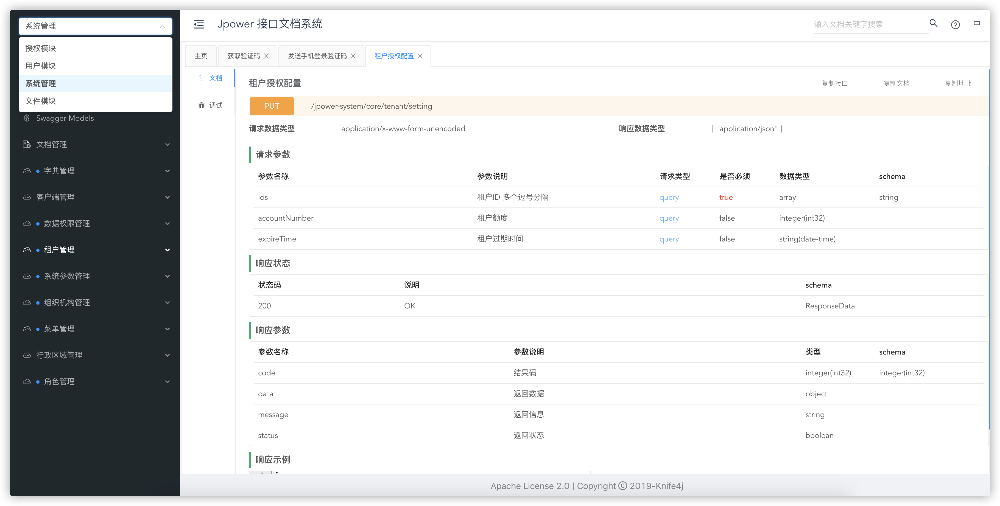 | 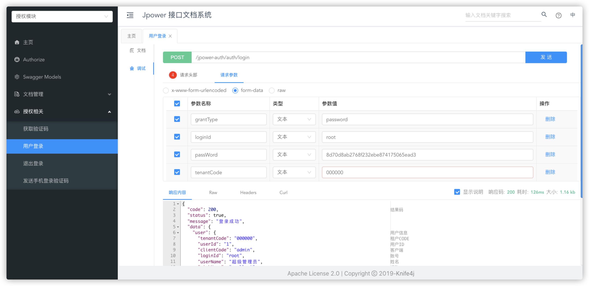 |
| 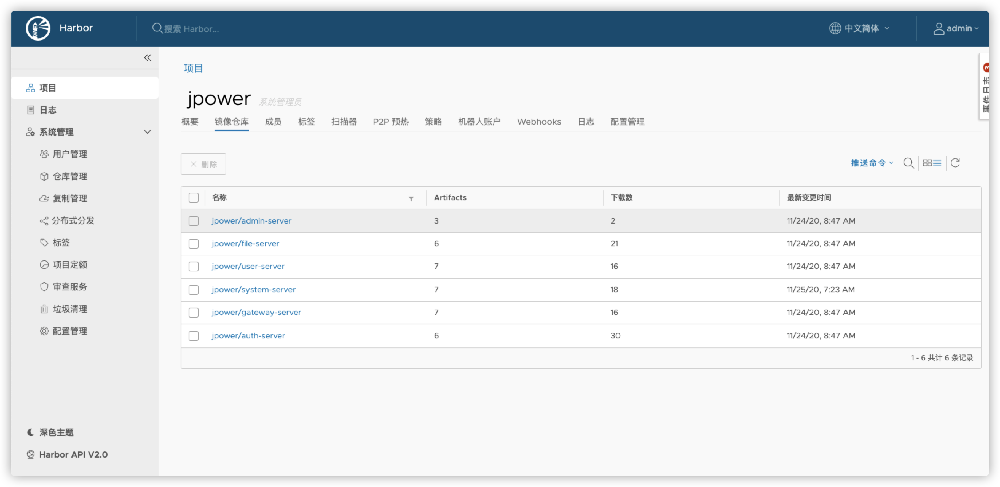 | 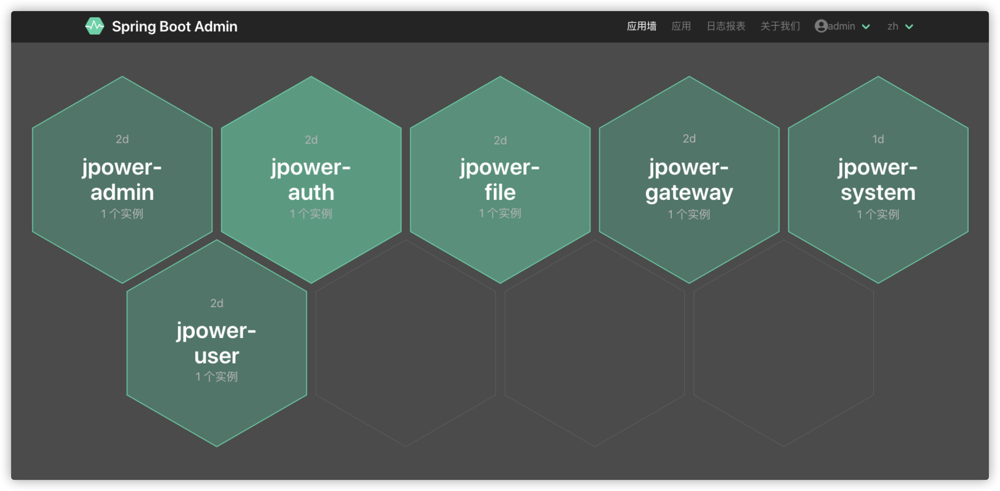 |
| 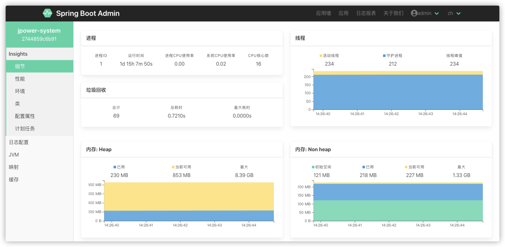 | 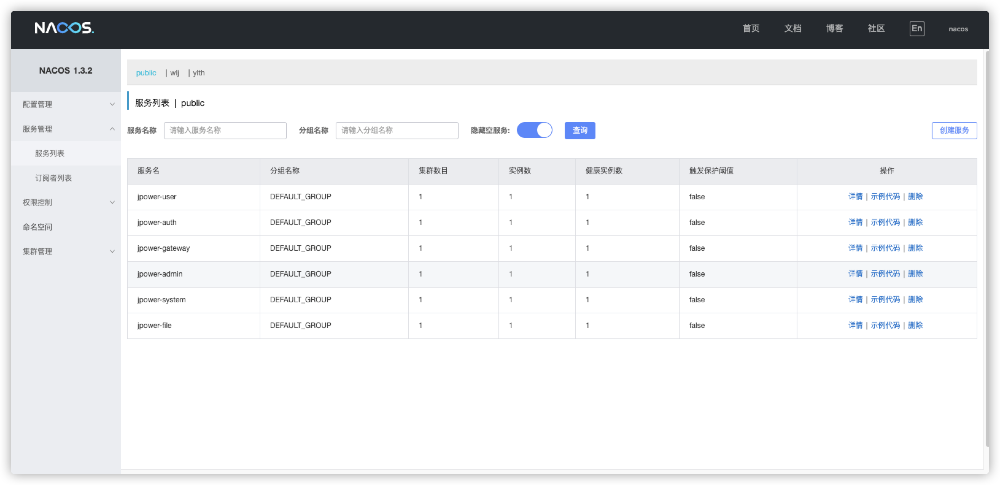 |
| 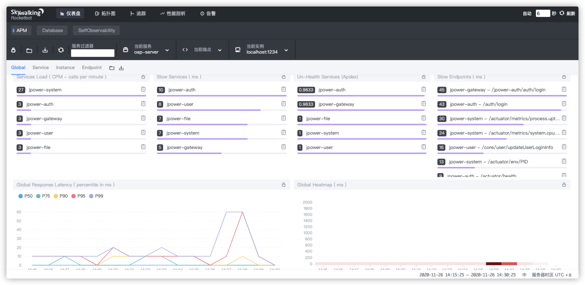 | 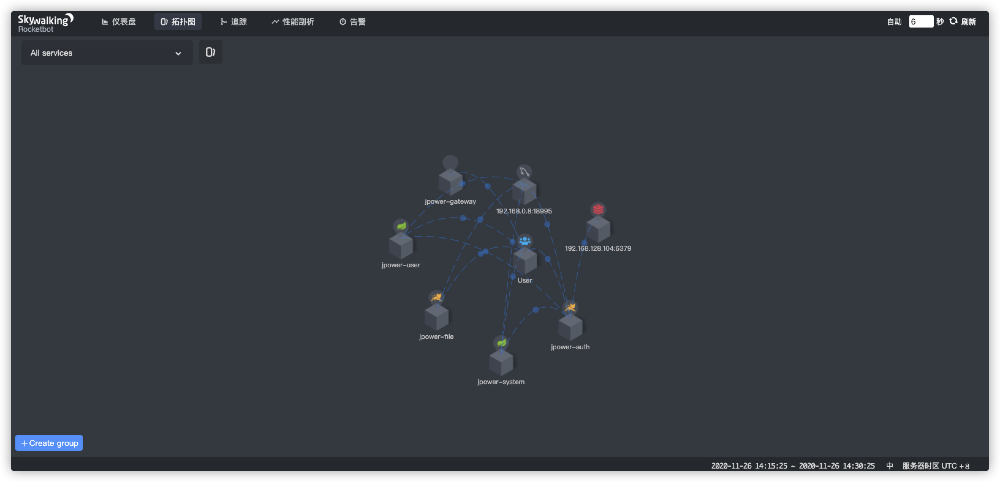 |
| 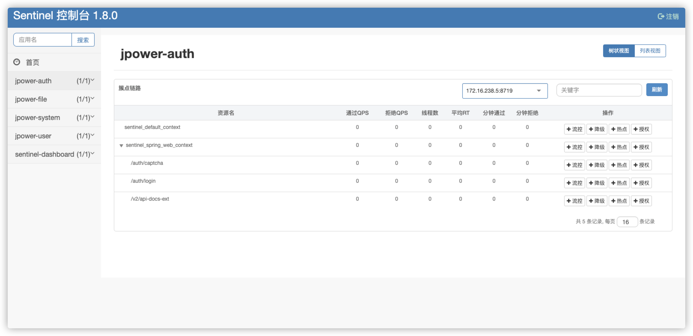 | 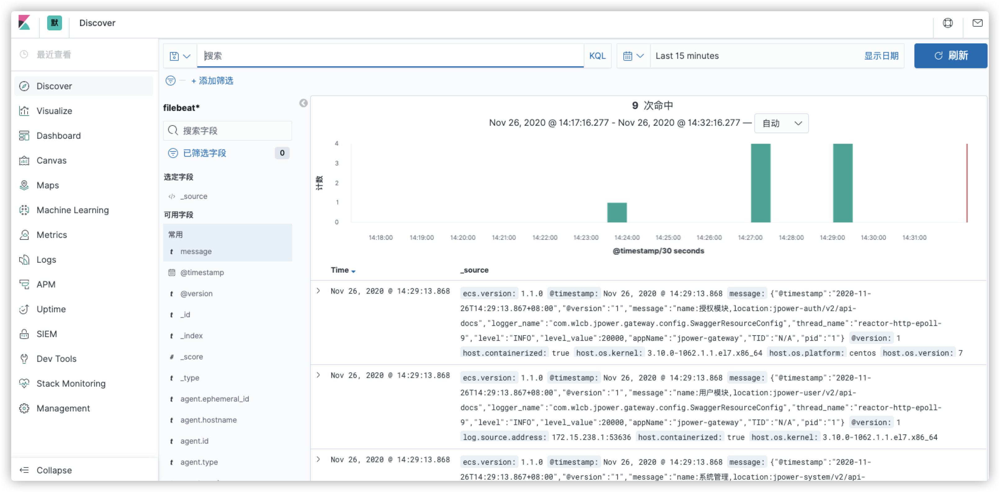 |
| 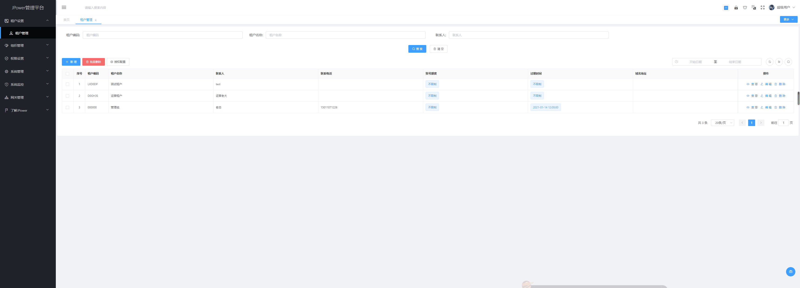 | 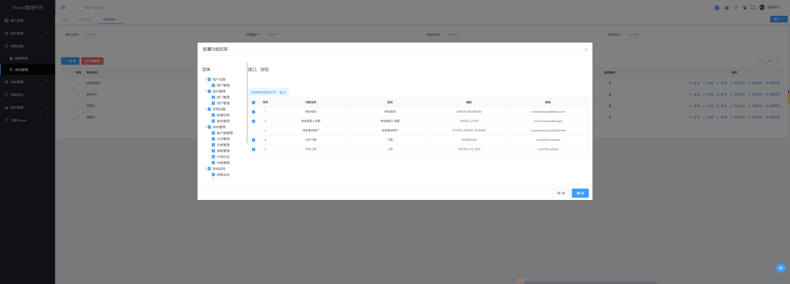  |
| 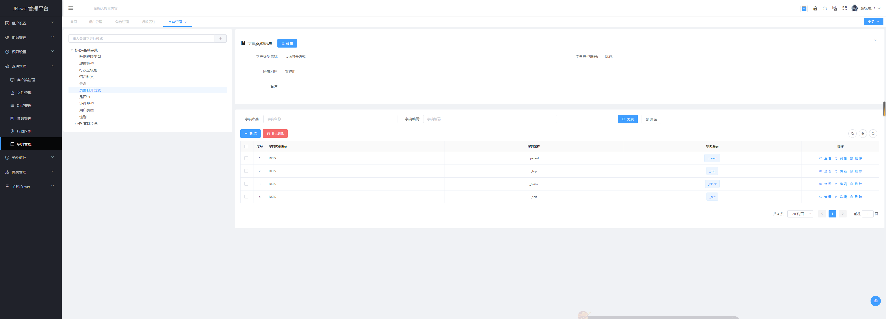 | 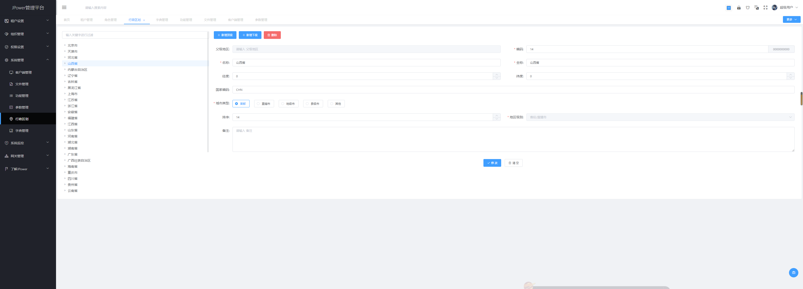 |

# If you find this project helpful in any way, please click "Star" in the upper right corner to support it, and spread the word to your friends and colleagues. Thank you!

# Found a bug? Please submit [issues](https://gitee.com/gdzWork/JPower/issues)

# Contributing
1. Fork this repository
2. Create a new feat_xxx branch
3. Commit your code
4. Create a new Pull Request

# Thanks to JetBrains for the free open source license:

# Links & Special Thanks
* Microservice Rapid Development Platform: [https://gitee.com/gdzWork/JPower](https://gitee.com/gdzWork/JPower)
* JPowerWeb [https://gitee.com/deep_letters/jpower](https://gitee.com/deep_letters/jpower)
* jpower-ui: [https://gitee.com/gdzWork/jpower-ui](https://gitee.com/gdzWork/jpower-ui)
* Avue: [https://gitee.com/smallweigit/avue](https://www.avuejs.com/)
* JWchat: [https://gitee.com/CodeGI/chat](https://gitee.com/CodeGI/chat)
* SpringBlade [https://gitee.com/CodeGI/chat](https://gitee.com/smallc/SpringBlade)
