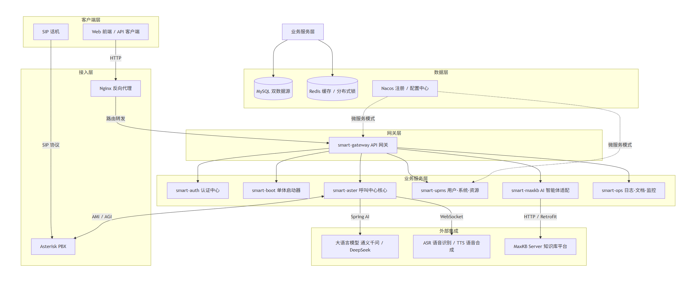
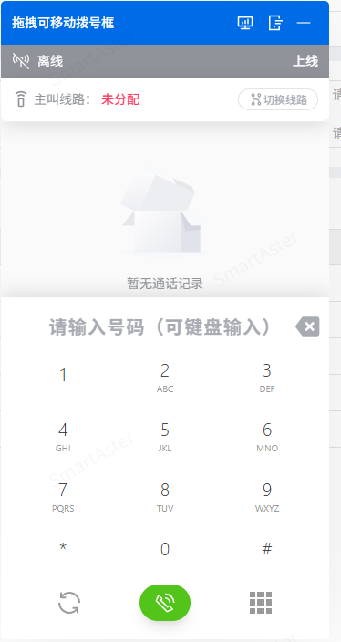
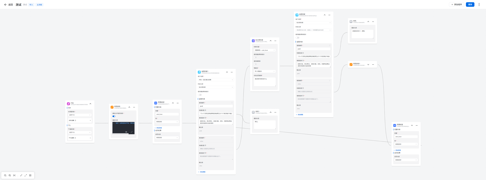
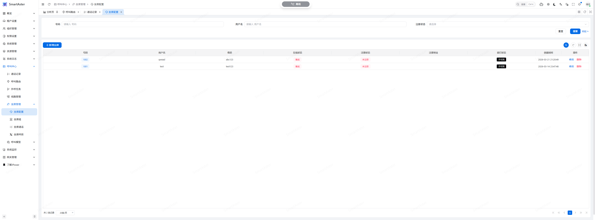

<p align="center">
  
</p>

<h1 align="center">SmartCall · AI 客服呼叫中心</h1>

<p align="center">
  <strong>AI 驱动的智能客服呼叫中心系统，让每一通电话都被智慧对待</strong>
</p>

<p align="center">
  <a href="https://qidiangk.com/" target="_blank">官网</a> |
  <a href="https://smartaster.qidiangk.com" target="_blank">🎯 在线演示</a> |
  <a href="#-核心能力">核心能力</a> |
  <a href="#-系统架构">系统架构</a> |
  <a href="#-技术栈">技术栈</a> |
  <a href="#-快速开始">快速开始</a>
</p>

<p align="center">
  
  
  
  
  
  
  
  
</p>

---

## 📖 项目简介

**SmartCall** 是一套基于 AI 大模型 + Asterisk 通信引擎构建的新一代智能客服呼叫中心系统。系统深度融合了 **AI 语音机器人**、**智能 IVR 流程编排**、**实时语音识别（ASR）**、**语音合成（TTS）**、**大模型意图识别** 等核心能力，为企业提供从呼入智能应答到智能外呼的全链路 AI 客服解决方案。

无论是电商售后、金融催收、教育招生还是企业客服，SmartCall 都能通过灵活的流程编排和强大的 AI 能力，帮助企业大幅降低人工成本、提升服务效率与客户满意度。


> 🎯 **在线演示**：[https://smartaster.qidiangk.com](https://smartaster.qidiangk.com)
>
> 账号：`demo` ｜ 密码：`123456`

> **SmartCall**提供了完整的部署与开发文档：[qidiangk.com](https://qidiangk.com/docs/deploy)，涵盖开发环境配置、服务端启动、前端运行、微服务部署和单体部署等关键步骤。

> 💡 本项目专注于**传统呼叫中心与 AI 大模型的深度融合**这一核心技术方向，围绕 IVR 流程编排、ASR 语音识别、TTS 语音合成、大模型意图识别、智能体知识库问答等关键链路，致力于构建 AI 客服机器人与用户之间自然、流畅的智能对话交互能力。项目采用清晰的模块化架构设计，具备良好的扩展基础，开发者可在此之上根据实际业务需求进行二次开发，灵活扩展坐席管理、线路管理、工单系统等运营管理模块及配套前端界面。如果本项目对您有所帮助，欢迎 Star 给予支持，这也是我们持续迭代和优化的最大动力 ⭐

## ✨ 核心能力

### 🤖 AI 智能应答

- **大模型意图识别** — 集成通义千问（DashScope）、DeepSeek 等主流大模型，通过 Prompt 工程实现精准的来电意图分类，支持自定义意图配置
- **AI 智能体对话** — 内置知识库智能体集成能力（已对接 MaxKB），AI 机器人可基于企业知识库进行多轮智能问答，支持按来电号码自动维护对话上下文、智能体选择与会话管理。架构上采用 `NodeGranter` 插件化设计，可扩展对接 Dify、Coze、FastGPT 等任意 AI Agent 平台
- **正则 + 模型双引擎** — 意图判断支持正则表达式快速匹配与 AI 模型深度识别的双重策略，兼顾响应速度与识别精度
- **情绪分析** — 集成阿里云 NLP 情感分析能力，实时感知客户情绪变化，负面情感自动升级至人工坐席
- **AI 信息提取** — 基于大模型自动从客户对话中提取姓名、地址、订单号等结构化关键信息，无需人工录入

### 📞 智能 IVR 流程编排

- **可视化流程设计** — 基于 LogicFlow 实现的拖拽式 IVR 流程编排器，支持节点连线、条件分支、子流程嵌套
- **丰富的流程节点**：
    - 🎙️ **语音播放（Say）** — TTS 实时合成语音播报，支持 SpEL 表达式动态内容
    - 🎧 **语音识别收听（Answer）** — ASR 实时语音转文字，采集客户语音指令，并支持客户实时打断
    - 🔢 **DTMF 收号（Received）** — 支持按键输入采集
    - 🧠 **意图识别（Intention）** — AI 大模型驱动的多意图分类节点
    - 🤖 **智能体对话（Agent）** — 调用知识库智能体进行多轮问答，支持上下文记忆与智能体动态选择
    - 🔀 **条件分支（Condition）** — 基于 SpEL 表达式的动态条件路由
    - 📋 **信息提取（Extract）** — AI 自动从对话中提取结构化关键信息
    - 🔌 **HTTP 服务调用（Service）** — 流程中直接调用外部 API，实时查询业务数据
    - 📜 **脚本执行（Script）** — 支持 Groovy / JavaScript 脚本在线编写与调试
    - 🔗 **转接人工（Transfer）** — 智能队列分配，支持按坐席组策略路由
    - 📂 **子流程调用（Child）** — 流程模块化复用，降低编排复杂度
    - 📌 **变量赋值（Variable）** — 全局变量动态管理，支撑流程间数据传递
    - 📴 **挂断（Hangup）** — 支持挂断前播放结束语
- **在线调试工具** — 内置 HTTP 接口测试器、脚本语法校验器（JavaScript / Groovy Lint），流程节点即编即测

### 🔐 企业级架构基座

- **微服务 + 单体双模** — 基于 Spring Cloud 构建，支持微服务独立部署或单体一键启动，灵活适配不同规模场景
- **RBAC 权限体系** — 基于角色的细粒度权限控制，精确到按钮级别
- **多租户架构** — 原生支持多租户数据隔离，一套系统服务多家企业
- **OAuth2 统一认证** — 统一身份认证网关，支持多种客户端接入
- **API 网关** — 统一路由、鉴权过滤、跨域处理、访问日志、限流保护

## 🧩 可扩展能力

本项目在架构层面为以下运营管理功能提供了完整的数据模型与扩展接口，开发者可基于现有框架和 API 层进行二次开发：

| 功能模块 | 扩展基础 | 说明 |
| --- | --- | --- |
| 📊 数据大屏 | 通话数据模型与统计 VO | 通话趋势、AI/人工占比、坐席效能等多维度分析 |
| 👥 坐席管理 | PJSIP 队列策略与 SSE 状态推送 | 坐席全生命周期管理、实时状态监控、通话保持/转接 |
| 📋 通话记录（CDR） | 通话记录实体与转接链路数据 | 全量通话记录、AI 通话筛选、录音管理、呼损统计 |
| 📤 智能外呼 | 外呼任务实体与分布式调度基础 | 批量外呼、智能重拨、多机器人并发、去重校验 |
| 📡 线路管理 | Asterisk PJSIP 端点与注册数据 | SIP 中继线路注册、状态监控、多线路智能路由 |

## 🏗️ 系统架构

SmartCall 采用**微服务 + 单体双模架构**，既支持微服务独立部署满足高可用与弹性伸缩需求，也支持单体模式一键启动快速部署，灵活适配不同规模的企业场景。

### 架构拓扑



**核心调用链路**：

- **语音通话**：SIP 话机 → Asterisk PBX（SIP 协议）→ AGI 触发 IVR 流程 → smart-aster 执行节点链
- **API 请求**：Web 前端 → Nginx → Gateway（路由 / 鉴权）→ 各业务服务
- **IVR 节点执行**：ASR/TTS 节点 → WebSocket → 语音服务（通义千问 DashScope / 阿里云 NLS / 电信）
- **智能体对话**：Agent 节点 → smart-maxkb → MaxKB Server（HTTP 多轮对话）

### 模块说明

| 模块 | 说明 |
| --- | --- |
| `smart-aster` | **核心呼叫模块** — 集成 Asterisk AMI/AGI，实现呼叫控制、IVR 流程引擎、ASR/TTS 对接、AI 意图识别等核心通信能力 |
| `smart-maxkb` | **AI 智能体模块** — 智能体平台适配层，内置 MaxKB 对接实现，管理智能体应用列表、API Key 认证、多轮对话会话管理，为 IVR 流程提供知识问答能力。基于模块化设计，可扩展对接其他 AI Agent 平台 |
| `smart-gateway` | **API 网关** — 基于 Spring Cloud Gateway，统一路由转发、OAuth2 鉴权、跨域处理、访问日志、动态路由 |
| `smart-auth` | **认证中心** — 统一身份认证与授权服务，支持 OAuth2 多客户端接入 |
| `smart-boot` | **单体启动器** — 聚合所有模块的单体模式启动入口，一键运行完整系统，无需微服务基础设施 |
| `smart-api` | **服务间 API** — 各微服务间的 Feign 客户端接口定义（含 smart-system-api、smart-user-api、smart-resource-api、smart-maxkb-api） |
| `smart-common` | **公共模块** — 通用常量、枚举、校验注解、公共工具类 |
| `smart-upms` | **用户权限管理** — 包含 smart-system（系统管理、字典、组织、角色、菜单、租户）、smart-user（用户、岗位）、smart-resource（文件、OSS、短信） |
| `smart-ops` | **运维监控** — 包含 smart-log（操作日志、监控面板）、smart-doc（Knife4j 接口文档聚合）、smart-admin（Spring Boot Admin 服务监控） |

### 双模运行

- **微服务模式**：各模块独立部署为 Spring Cloud 微服务，通过 Nacos 进行服务注册与配置管理，Gateway 统一网关路由，适合大规模生产部署
- **单体模式**：运行 `smart-boot` 模块即可启动完整系统，无需 Nacos / Gateway 等中间件依赖，适合中小规模快速部署与开发调试

## 🛠️ 技术栈

### 后端技术栈

| 技术 | 版本 | 说明 |
| --- | --- | --- |
| Java | 17 | 基础运行环境 |
| Spring Boot | 3.5.x | 应用框架 |
| Spring Cloud | 2025.x | 微服务治理 |
| Spring Cloud Alibaba | - | Nacos / Sentinel / Seata |
| Spring AI | - | 大模型集成框架（DashScope / DeepSeek） |
| MyBatis-Flex | 1.11.5 | ORM 持久层框架 |
| Asterisk + PJSIP | - | 开源 PBX 通信引擎 |
| Asterisk-Java | - | Asterisk AMI / AGI Java SDK |
| Alibaba NLS SDK | 2.2.x | 阿里云智能语音（ASR / TTS） |
| DashScope SDK | - | 通义千问语音（Qwen3-ASR / CosyVoice / Qwen-TTS） |
| Spring Cloud Gateway | - | API 网关 |
| OpenFeign + OkHttp | - | 服务间调用 |
| Knife4j / SpringDoc | - | 接口文档 |
| Redisson | - | 分布式锁 / 缓存 / 消息 |
| Druid | - | 数据库连接池与 SQL 监控 |
| Retrofit | - | MaxKB HTTP 客户端 |
| Groovy / Nashorn | 3.0 / 15.6 | 动态脚本引擎 |
| Undertow | - | 高性能 Web 容器 |
| Docker / Docker Compose | - | 容器化部署 |
| SkyWalking | 10.4 | 分布式链路追踪 |

### AI 与通信能力

| 能力 | 支持 | 说明 |
| --- | --- | --- |
| 大语言模型 | 通义千问 / DeepSeek | 基于 Spring AI 统一抽象，可平滑切换模型 |
| ASR 语音识别 | 阿里云 NLS / 通义千问 DashScope / 电信 ASR | 实时流式语音转文字，支持多种模型与自定义对接 |
| TTS 语音合成 | 阿里云 NLS / 通义千问 DashScope / 电信 TTS | 文字转语音播报，支持多模型、多音色与参数配置 |
| 情感分析 | 阿里云 NLP | 实时情感倾向判断（正面 / 负面 / 中性） |
| 知识库问答 | MaxKB（内置）/ 可扩展 | 企业知识库智能体多轮对话，支持扩展对接 Dify、Coze、FastGPT 等平台 |

> 💡 **扩展能力**：系统通过 `VoiceModelEnum` 枚举统一管理语音引擎，ASR 和 TTS 均基于接口抽象实现。目前已内置阿里云、通义千问（DashScope）、电信三家引擎，同时支持企业自定义对接第三方 ASR/TTS 引擎（如科大讯飞、百度语音、腾讯云等），只需实现对应接口即可无缝替换。

## 🖥️ 功能截图

> 以下截图来自完整产品演示环境，其中坐席管理、通话记录、外呼任务等运营管理界面属于可扩展能力，开发者可基于本项目二次开发实现。

### 拨号盘


### IVR 流程编排


### 通话记录


### 坐席管理


### 外呼任务


## 🚀 快速开始

### 环境要求

| 组件 | 版本要求                  |
| --- |-----------------------|
| JDK | 17+                   |
| MySQL | 8.0+                  |
| Redis | 6.0+                  |
| Asterisk | 22 (PJSIP)            |
| Nacos | 3.x（微服务模式需要）          |
| MaxKB | v2.6.1（可选，AI 知识库问答需要） |

### 数据库初始化

1. 创建数据库：

```sql
CREATE DATABASE smartaster DEFAULT CHARACTER SET utf8mb4 COLLATE utf8mb4_general_ci;
CREATE DATABASE smartaster_asterisk DEFAULT CHARACTER SET utf8mb4 COLLATE utf8mb4_general_ci;
```

2. 导入 SQL 脚本：

```
sql/mysql_create_core.sql     -- 核心表结构
sql/mysql_smartaster.sql      -- 业务数据
sql/mysql_asterisk.sql        -- Asterisk 配置表
```

### 后端启动

#### 单体模式（推荐开发环境）

```bash
# 1. 克隆项目
git clone <仓库地址>
cd SmartAster

# 2. 修改配置
# 编辑 smart-boot/src/main/resources/application.yml
# 修改 MySQL、Redis 等连接信息

# 3. 编译打包
mvn clean package -DskipTests

# 4. 启动 BootStartApplication
java -jar smart-boot/target/smart-boot.jar
```

> 单体模式无需 Nacos / Gateway，直接访问 `http://localhost:9999` 即可

#### 微服务模式

```bash
# 1. 启动基础设施
cd script/app
docker-compose up -d nacos

# 2. 配置 Nacos
# 将 docs/config/nacos/ 下的配置文件导入 Nacos

# 3. 依次启动各微服务
java -jar smart-gateway/target/smart-gateway.jar
java -jar smart-auth/target/smart-auth.jar
java -jar smart-aster/target/smart-aster.jar
java -jar smart-upms/smart-system/target/smart-system.jar
java -jar smart-upms/smart-user/target/smart-user.jar
java -jar smart-upms/smart-resource/target/smart-resource.jar
java -jar smart-ops/smart-log/target/smart-log.jar
java -jar smart-maxkb/target/smart-maxkb.jar
```

### Asterisk 部署

```bash
# 使用项目提供的 Dockerfile 构建镜像一键部署 Asterisk
cd script/asterisk/image
docker build -t smart/asterisk:22 .

cd script/asterisk
docker-compose up -d
```

> Asterisk 配置请参考 `script/asterisk/image/conf/` 目录下的配置文件

### Docker Compose 一键部署


```bash
mvn clean compile jib:dockerBuild
cd boot/app
docker-compose up -d
```

## 📁 项目结构

```
SmartCall
├── smart-aster              # 核心呼叫模块（IVR引擎 / ASR / TTS / AI意图）
├── smart-maxkb              # MaxKB 智能体对接模块
├── smart-gateway            # API 网关（路由/鉴权/限流/日志）
├── smart-auth               # 统一认证中心
├── smart-boot               # 单体模式启动器
├── smart-api                # 服务间 Feign API
│   ├── smart-system-api
│   ├── smart-user-api
│   ├── smart-resource-api
│   └── smart-maxkb-api
├── smart-common             # 公共模块（常量/枚举/校验注解）
├── smart-upms               # 用户权限管理
│   ├── smart-system         #   系统管理（字典/组织/角色/菜单/租户）
│   ├── smart-user           #   用户管理（用户/岗位/角色用户）
│   └── smart-resource       #   资源管理（文件/OSS/短信）
├── smart-ops                # 运维监控
│   ├── smart-log            #   日志与监控
│   ├── smart-doc            #   Knife4j 接口文档聚合
│   └── smart-admin          #   Spring Boot Admin
├── script                   # 部署脚本
│   ├── app                  #   Docker Compose 编排
│   ├── asterisk             #   Asterisk 镜像与配置
│   ├── docker               #   Nacos / Nginx / SkyWalking / ELK 配置
│   └── elk                  #   ELK 日志栈
├── sql                      # 数据库脚本
└── docs                     # 文档与配置模板
```

## 🔌 扩展与集成

### 自定义 ASR / TTS 引擎

系统通过 `VoiceModelEnum` 枚举统一管理语音引擎，在 IVR 流程中可按节点选择 ASR/TTS 引擎。

#### 已内置引擎

| 引擎 | ASR 实现 | TTS 实现 | 说明 |
| --- | --- | --- | --- |
| 阿里云 | `AliAsrClient` | `AliTtsClient` | 阿里云 NLS 智能语音，WebSocket 流式通信 |
| 通义千问（DashScope） | `DashScopeAsrClient` | `DashScopeTtsClient` | 通义千问语音大模型，支持多模型自动路由 |
| 电信 | `DianxinAsrClient` | `DianxinTtsClient` | 电信 AI 语音，WebSocket 流式通信 |

#### 通义千问（DashScope）详细说明

通义千问引擎采用**代理 + 模型路由**架构，根据配置的模型名称自动选择底层实现：

**ASR 语音识别**（`DashScopeAsrClient` 自动路由）：
- `DashScopeQwenAsrClient` — Qwen3-ASR 系列（`qwen3-asr-flash-realtime`），基于 `OmniRealtimeConversation` API
- `DashScopeFunAsrClient` — Fun-ASR / Paraformer 系列（`fun-asr-realtime`、`paraformer-realtime-8k-v2`），基于 `Recognition` API

**TTS 语音合成**（`DashScopeTtsClient` 自动路由）：
- `DashScopeQwenTtsClient` — Qwen3-TTS 系列（`qwen3-tts-flash-realtime`、`qwen3-tts-instruct-flash-realtime`）
- `DashScopeCosyVoiceTtsClient` — CosyVoice 系列（`cosyvoice-v3-flash`、`cosyvoice-v3-plus` 等）

```yaml
ivr:
  dashscope:
    api-key: ${IVR_DASHSCOPE_API_KEY:}          # DashScope API Key
    # 自定义 WebSocket 地址（内网私有化部署时配置，留空使用阿里云官方地址）
    # websocket-url: wss://your-private-dashscope-server/api-ws/v1/realtime
    asr-option:
      model: qwen3-asr-flash-realtime            # ASR 模型
      sample-rate: 8000                           # 采样率（电话场景建议 8000）
      language: zh                                # 识别语言
    tts-option:
      model: qwen3-tts-flash-realtime            # TTS 模型
      sample-rate: 8000                           # 采样率
      volume: 50                                  # 音量 [0, 100]
      speech-rate: 1.0                            # 语速 [0.5, 2.0]
```

> 💡 IVR 流程中每个节点可独立配置 ASR/TTS 引擎参数（模型、音色、采样率等），页面传入的动态配置会自动覆盖配置文件中的默认值，实现灵活的多引擎混用。

### 自定义 AI 大模型

基于 Spring AI 统一抽象，通过配置切换不同的大模型提供商：

```yaml
jpower:
  ai:
    primary: dashscope    # 可选: dashscope / deepseek / 等等其他模型需要自行引入jar
spring:
  ai:
    dashscope:
      api-key: your-api-key
      chat:
        options:
          model: qwen3.5-plus
    deepseek:
      api-key: your-api-key
      chat:
        options:
          model: deepseek-r1
```

### AI 智能体平台集成

系统内置了 MaxKB 知识库平台的对接实现，通过 `AgentChatClient` Feign 接口与智能体服务交互，支持智能体选择、API Key 自动管理、按来电号码维护对话上下文等能力。IVR 流程中的「智能体对话」节点通过 `NodeGranter` 插件机制调用智能体服务，开发者可基于同一机制扩展对接其他 AI Agent 平台：

```yaml
maxkb:
  username: admin
  password: your-password
  baseUrl: http://your-maxkb-host:8081/
  externalBaseUrl: http://your-maxkb-host:8081/   # 外网访问地址
```

### 内网环境部署

系统**完整支持内网（私有化）环境部署**，所有外部依赖均可通过配置指向内网地址：

- **语音引擎**：通义千问 DashScope 支持自定义 `websocket-url`，可将 ASR/TTS 的 WebSocket 连接指向内网私有化部署的语音服务，无需访问公网
- **AI 大模型**：DeepSeek / 通义千问等模型均通过 `base-url` 配置，可对接内网部署的大模型推理服务（如 vLLM、Ollama 等）
- **智能体平台**：MaxKB 的 `baseUrl` 配置项直接支持内网地址
- **基础设施**：MySQL、Redis、Nacos、Asterisk 等全部通过环境变量注入连接信息，适配任意内网环境
- **容器化部署**：提供完整的 Docker Compose 编排文件，一键拉起全部服务

## 📄 开源协议

SmartCall 开源软件遵循 [Apache 2.0 协议](https://www.apache.org/licenses/LICENSE-2.0.html) ，允许商业使用，但务必保留类作者、Copyright 信息。

## 🌱 参与贡献

SmartCall 的成长离不开社区的每一份力量。无论是提交一个 Bug 修复、分享一个功能想法、完善一段文档，还是提出一个优化建议，都是对项目实实在在的推动。

- 🐛 **报告问题**：使用中遇到问题？欢迎通过 [Issue](../../issues) 反馈，请尽量附上复现步骤与环境信息
- 💡 **功能建议**：有好的想法或改进思路？通过 Issue 发起讨论，我们一起评估可行性
- 🔧 **提交代码**：Fork 项目 → 创建分支 → 提交 Pull Request，请确保代码风格与现有规范保持一致
- 📖 **完善文档**：文档的清晰与完善对每一位新用户都至关重要，欢迎补充和修正

期待与你一起，让 SmartCall 变得更好。

## 🤝 联系我们

- **官网**：[https://qidiangk.com](https://qidiangk.com)
- **邮箱**：ding931226@yeah.net
- **企业服务**：如需开箱即用的完整呼叫中心解决方案与技术支持，欢迎通过官网了解

---

<p align="center">
  <strong>SmartCall — 让 AI 为每一通电话赋能</strong>
</p>
