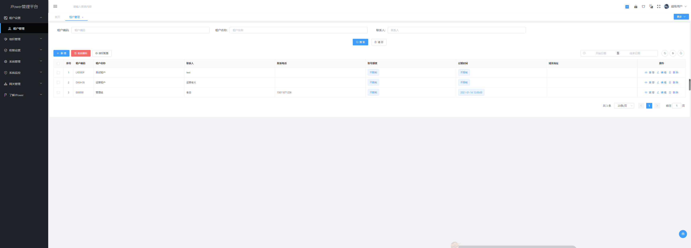
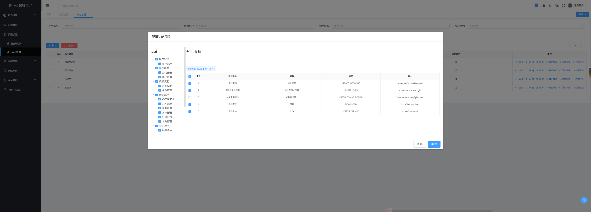

# JPower：中后台快速开发平台

   

-------

## JPower 简介
`JPower`是由一款政府商业项目升级优化而来。

采用前后端分离的模式，前端开源项目：jpower-ui (基于 AVue、Vue、Element-UI)

`JPower` 基于`SpringCloud(Hoxton.SR7)`  + `SpringBoot(2.2.5.RELEASE)` 的微服务快速开发平台.
具备网关统一鉴权、Xss防跨站攻击、分布式事务等多个模块，支持多业务系统并行开发，
支持多服务并行开发，可以作为后端服务的开发脚手架。代码简洁，注释齐全，架构清晰，非常适合学习和作为基础框架使用。

核心技术采用Spring Cloud Alibaba、SpringBoot、Mybatis、Seata、Sentinel、SkyWalking等主要框架和中间件。
希望能努力打造一套从集 `基础框架` `分布式微服务架构` `持续集成` `系统监测` 的解决方案。`本项目旨在实现基础能力，不涉及具体业务。`

采用JWT做Token认证，可拓展集成Redis等细颗粒度控制方案。

注册中心、配置中心选型Nacos，为工程瘦身的同时加强各模块之间的联动。

集成Sentinel从流量控制、熔断降级等多个维度保护服务的稳定性。

## 分支介绍
1. master 分支为最新的稳定版本，每次提交都会升级一个版本号
2. dev 分支为作者的开发分支，作者开发的最新功能会实时提交上来，喜欢尝鲜的可以切换为dev。 但可能有报错、漏提等，对项目不是很熟的朋友千万别尝试。
3. tag 每个固定的版本都会打一个tag方便后续切换任意版本。

## 项目演示地址
- 项目演示地址： http://jpower.top:81
- 超级用户登录（租户编码：000000）：
- 超级管理员： root/123456
- 租户用户登录（租户编码：LXD0DP）：
- 普通账号： admin/123456

> ps: 演示环境中没有写入权限

## 业务功能介绍：
1. 租户管理：超级用户角色管理所有的租户创建
3. 组织管理：部门、用户数据维护、重置用户密码等
4. 权限设置：数据权限、角色管理、给角色绑定用户、给角色授权菜单和资源
6. 系统设置：菜单功能、附件管理、字典、行政地区、系统参数、应用管理等
7. 网关管理：限流和阻止访问、注册中心
8. 系统监控：接口文档、服务监控、SkyWalking监控等

## 项目亮点功能介绍:
1. **服务注册&发现与调用：**

    基于Nacos来实现的服务注册与发现，使用使用OpenFeign来实现服务互调, 可以做到使用HTTP请求远程调用时能与调用本地方法一样的编码体验，开发者完全感知不到这是远程方法，更感知不到这是个HTTP请求。

3. **服务鉴权:**

    通过JWT的方式来加强服务之间调度的权限验证，保证内部服务的安全性。

4. **熔断机制：**

    因为采取了服务的分布，为了避免服务之间的调用“雪崩”，采用了Hystrix的作为熔断器，避免了服务之间的“雪崩”。

5. **监控：**

    利用Spring Boot Admin 来监控各个独立Service的运行状态；通过SkyWalking来查看各个服务之间的调用链等。

6. **链路调用监控：**

    同时实现了SkyWalking作为本项目的全链路性能监控， 从整体维度到局部维度展示各项指标，将跨应用的所有调用链性能信息集中展现，可方便度量整体和局部性能，并且方便找到故障产生的源头，生产上可极大缩短故障排除时间。
    
7. **数据权限**

    利用基于Mybatis的拦截器实现了数据权限功能

8. **防跨站脚本攻击(XSS)**
  
    - 通过过滤器对所有请求中的 表单参数 进行过滤
    
9. **在线API**

    由于原生swagger-ui某些功能支持不够友好，故采用了国内开源的`knife4j`，并制作了stater，方便springboot用户使用。

10. **分布式事务**

    集成了阿里的分布式事务中间件：seata，以 **高效** 并且对业务 **0侵入** 的方式，解决 微服务 场景下面临的分布式事务问题。

11. **跨表、跨库、跨服务的字典数据自动查询**

    用于解决跨表、跨库、跨服务分页数据的属性或单个对象的属性 回显字典数据之痛, 支持对静态数据属性(数据字典)进行自动注入。

12. **灰度发布**
  
    为了解决频繁的服务更新上线，版本回退，快速迭代，公司内部协同开发，本项目采用修改ribbon的负载均衡策略来实现来灰度发布。
    
## 工程结构：
~~~
JPower
├── jpower-boot -- boot项目实现
├── jpower-core-login -- 授权登录模块
├── jpower-core-server -- 核心业务模块
├    ├── jpower-file -- 文件模块
├    ├    ├── file-api -- 文件API 
├    ├    ├── file-api-biz -- 文件API实现
├    ├    ├── file-biz -- 文件业务实现 
├    ├    ├── file-entity -- 文件Entity 
├    ├    └── file-server -- 文件服务
├    ├── jpower-user -- 用户模块
├    ├    ├── user-api -- 用户API 
├    ├    ├── user-api-biz -- 用户API实现
├    ├    ├── user-biz -- 用户业务实现 
├    ├    ├── user-entity -- 用户Entity 
├    ├    └── user-server -- 用户服务
├    ├── jpower-system -- 系统模块
├    ├    ├── system-api -- 系统API 
├    ├    ├── system-api-biz -- 系统API实现
├    ├    ├── system-biz -- 系统业务实现 
├    ├    ├── system-entity -- 系统Entity 
├    └──  └── system-server -- 系统服务
├── jpower-module-common -- 工具包模块
├    ├── common-auth -- 授权工具包 
├    ├── common-dbs -- 数据库工具包 
├    ├── common-deploy -- 基础启动工具包 
├    ├── common-exception -- 异常工具包
├    ├── common-feign -- feign工具包 
├    ├── common-log -- 日志工具包 
├    ├── common-nacos -- nacos工具包 
├    ├── common-redis -- 缓存工具包 
├    ├── common-sentinel -- sentinel工具包 
├    ├── common-swagger -- swagger工具包 
├    ├── common-tool -- 综合工具包 
├    ├── common-transaction -- 事务工具包 
├    └── common-utils -- 工具类 
├── jpower-module-gateway -- 网关模块
├── jpower-op-server -- 运维模块
└──  └── jpower-admin -- SpringBootAdmin 
~~~
    
## 技术栈：
* 所涉及的相关的技术有
    *   缓存：Redis
    *   数据库： MySQL 5.7
    *  持久层框架： Mybatis-plus
    *  API网关：Gateway
    *  服务注册与发现: Nacos
    *  服务消费：OpenFeign
    *  负载均衡：Ribbon
    *  配置中心：Nacos
    *  服务熔断：Hystrix
    *  项目构建：Maven 3.3
    *  分布式事务： seata
    *  分布式系统的流量防卫兵： Sentinel
    *  监控： spring-boot-admin
    *  链路调用跟踪&APM监控： skywalking
    *  Nginx
* 部署方面
    *  服务器：CentOS
    *  Docker 18
    *  Nginx

## 项目截图：

| 预览 | 预览 |
|---|---|
|  |  |
|  |  |
|  |  |
|  |  |
|  |  |
|  |   |
|  |  |

# 如果觉得本项目对您有任何一点帮助，请点右上角 "Star" 支持一下， 并向您的基友、同事们宣传一下吧，谢谢！

# 发现bug请提交 [issues](https://gitee.com/gdzWork/JPower/issues)

# 如果觉得还不错，请作者喝杯咖啡吧 ☺

# 友情链接 & 特别鸣谢
* 微服务快速开发平台：[https://gitee.com/gdzWork/JPower](https://gitee.com/gdzWork/JPower)
* jpower-ui：[https://gitee.com/gdzWork/jpower-ui](https://gitee.com/gdzWork/jpower-ui)
* Avue：[https://gitee.com/smallweigit/avue](https://www.avuejs.com/)
* JWchat：[https://gitee.com/CodeGI/chat](https://gitee.com/CodeGI/chat)
